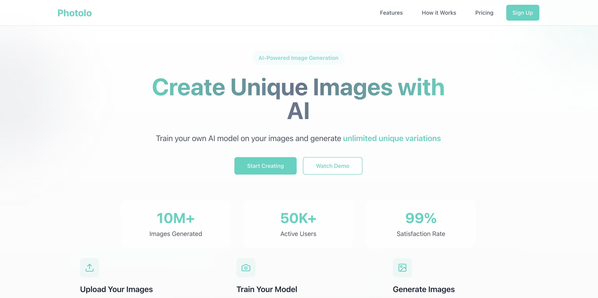

# PhotoIo

PhotoIo is an advanced image generation platform that allows users to train their own models and generate images from them. Users can fine-tune models based on their preferences and create unique visuals using text-based prompts.

## Features

- **Custom Model Training** – Train your own models with your dataset.
- **Text-to-Image Generation** – Generate images using AI-powered models with custom prompts.
- **Efficient Backend** – Powered by Bun and Express for high-performance API handling.
- **User Authentication** – Secure login and model management.
- **Fast Processing** – Optimized workflows for quick model training and image generation.

## Tech Stack

- **Frontend**: Next.js
- **Backend**: Bun with Express
- **Database**: PostgresSQL
- **Authentication**: I have used Clerk as the major authentication and synced my and clerks databases

## Architecture
The flow starts at the clerks authentication and a webhook is called by the clerk to updated the application database to maintain the state consistent.Then the user trains a model by specifying the features of the model (human in the images).
I have outsourced the model training and generation part to FalAi. The training request is send to the FalAi apis and eventually a webhook is called when the model is done training.
Then the user can hit the generate endpoint to generate the images with the specified prompt.

User ----> Clerk Auth.

Train ----> Images are zipped ----> Uploaded to S3 ----> Url returned ----> FalAi ----> Webhook ----> Training Done

Generate Images ----> FalAi


### Prerequisites
- Node.js / Bun
- Database 

## Installation
### Setup Instructions

1. **Clone the Repository**
   ```sh
   git clone https://github.com/yourusername/PhotoIo.git
   cd PhotoIo
   ```
2. **Install Dependencies**
   ```sh
   bun install
   ```
3. **Start the Backend Server**
   ```sh
   bun run start
   ```
4. **Start the Frontend**
   ```sh
   cd frontend
   bun run dev
   ```
5. **Access the Application**
   Open [http://localhost:3000](http://localhost:3000) in your browser.

## Usage

1. Sign up and log in to your account.
2. Upload your dataset and train a custom AI model.
3. Use text prompts to generate images based on your trained model.
4. Download and share your generated images.

## Contribution

Contributions are welcome! If you’d like to improve PhotoIo, feel free to fork the repo and create a pull request.


## Contact

For any inquiries, feel free to reach out at [your.email@example.com](mailto:your.email@example.com) or open an issue in the repository.

